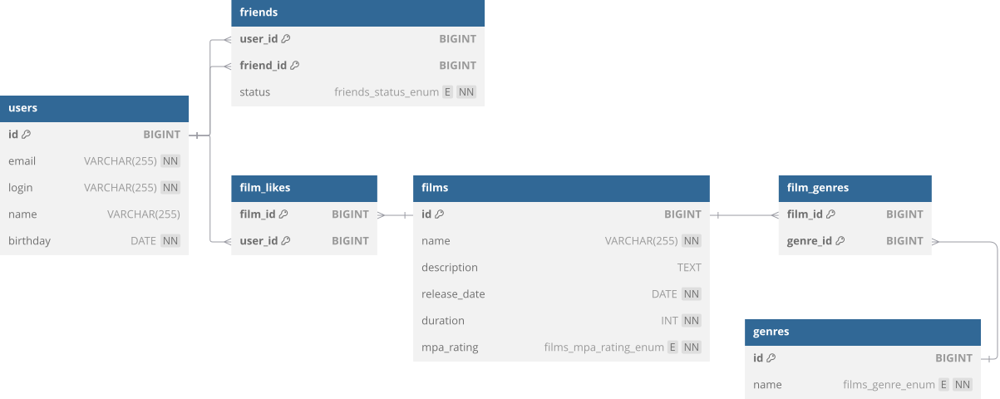

# java-filmorate

### В ходе группового проекта командой были реализованы следующие задачи:

1. Система отзывов
   - Разработана модель отзыва
   - Разработаны методы добавления, редактирования и удаления отзывов
   - Добавлена функциональность типа отзыва (негативный/положительный)
   - Добавлена функциональность оценки отзывов (полезно/бесполезно)
   - Внедрена сортировка отзывов по рейтингу полезности

2. Лента событий
   - Создана таблица для хранения событий пользователей
      - Реализовано отслеживание действий: добавление/удаление друзей, лайки, создание отзывов

3. Управление режиссёрами
   - Расширена модель фильма для хранения информации о режиссёрах
   - Реализована выборка фильмов режиссёра с сортировкой по количеству лайков
   - Добавлена сортировка фильмов режиссёра по годам выпуска

4. Рекомендательная система
   - Реализован алгоритм поиска пользователей с похожими предпочтениями на основе пересечения лайков
    - Добавлен механизм определения фильмов, которые понравились пользователям со схожими вкусами

5. Поисковая система 
   - Реализован поиск фильмов по подстроке в названии
   - Добавлен поиск по имени режиссёра и/или названию

6. Вывод популярных фильмов
   - Реализован топ-N фильмов по количеству лайков
   - Добавлены фильтры по жанру и году выпуска

7. Удаление данных
   - Реализовано каскадное удаление фильмов с очисткой связанных данных (лайки, жанры, режиссёры)
    - Добавлено удаление пользователей с обработкой зависимостей (друзья, лайки, отзывы)

8. Общие фильмы
   - Разработан алгоритм определения общих фильмов между двумя пользователями
   - Добавлена сортировка результатов по популярности


#### Техническая реализация:
- Использован Spring JDBC для взаимодействия с базой данных
- Реализованы хранилища данных с использованием паттерна Repository
- Внедрено логирование основных операций
- Написаны интеграционные тесты для проверки функциональности

## Диаграмма базы данных

Вы также можете посмотреть интерактивную диаграмму [здесь](https://dbdiagram.io/d/6818cc831ca52373f584aed3).

### Основные операции по работе с бд
1. Получение всех пользователей 
```
SELECT * FROM users;
```
2. Получение информации о конкретном пользователе по ID
```
SELECT * FROM users WHERE id = 1;
```
3. Получение всех друзей конкретного пользователя
```
SELECT u.*
FROM users u
JOIN friends f ON u.id = f.friend_id
WHERE f.user_id = 1 AND f.status = 'CONFIRMED';
```
4. Получение общих друзей между двумя пользователями
```
SELECT u.*
FROM users u
JOIN friends f1 ON u.id = f1.friend_id
JOIN friends f2 ON u.id = f2.friend_id
WHERE f1.user_id = 1 AND f2.user_id = 2 AND f1.status = 'CONFIRMED' AND f2.status = 'CONFIRMED';

```
5. Получение всех пользователей, которые являются друзьями друг друга
```
SELECT u1.id AS user_id, u1.name AS user_name, u2.id AS friend_id, u2.name AS friend_name
FROM users u1
JOIN friends f1 ON u1.id = f1.user_id
JOIN users u2 ON f1.friend_id = u2.id
WHERE f1.status = 'CONFIRMED';
```
6. Получение информации о конкретном фильме по ID
```
SELECT * FROM films WHERE id = 1;
```
7. Получение топ-10 фильмов по количеству лайков
```
SELECT f.*, COUNT(fl.film_id) AS like_count
FROM films f
LEFT JOIN film_likes fl ON f.id = fl.film_id
GROUP BY f.id
ORDER BY like_count DESC
LIMIT 10;
```
