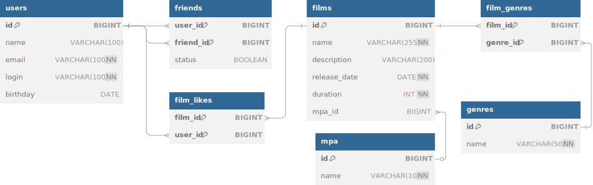

# java-filmorate
Template repository for Filmorate project.
## Диаграмма базы данных

Вы также можете посмотреть интерактивную диаграмму [здесь](https://dbdiagram.io/d/6818cc831ca52373f584aed3).

### Основные операции по работе с бд
1. Получение всех пользователей 
```
SELECT * FROM users;
```
2. Получение информации о конкретном пользователе по ID
```
SELECT * FROM users WHERE id = 1;
```
3. Получение всех друзей конкретного пользователя
```
SELECT u.*
FROM users u
JOIN friends f ON u.id = f.friend_id
WHERE f.user_id = 1 AND f.status = 'CONFIRMED';
```
4. Получение общих друзей между двумя пользователями
```
SELECT u.*
FROM users u
JOIN friends f1 ON u.id = f1.friend_id
JOIN friends f2 ON u.id = f2.friend_id
WHERE f1.user_id = 1 AND f2.user_id = 2 AND f1.status = 'CONFIRMED' AND f2.status = 'CONFIRMED';

```
5. Получение всех пользователей, которые являются друзьями друг друга
```
SELECT u1.id AS user_id, u1.name AS user_name, u2.id AS friend_id, u2.name AS friend_name
FROM users u1
JOIN friends f1 ON u1.id = f1.user_id
JOIN users u2 ON f1.friend_id = u2.id
WHERE f1.status = 'CONFIRMED';
```
6. Получение информации о конкретном фильме по ID
```
SELECT * FROM films WHERE id = 1;
```
7. Получение топ-10 фильмов по количеству лайков
```
SELECT f.*, COUNT(fl.film_id) AS like_count
FROM films f
LEFT JOIN film_likes fl ON f.id = fl.film_id
GROUP BY f.id
ORDER BY like_count DESC
LIMIT 10;
```
